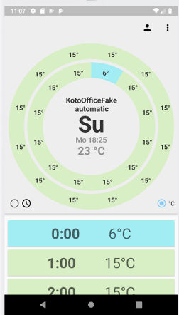
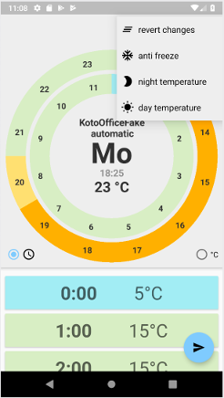
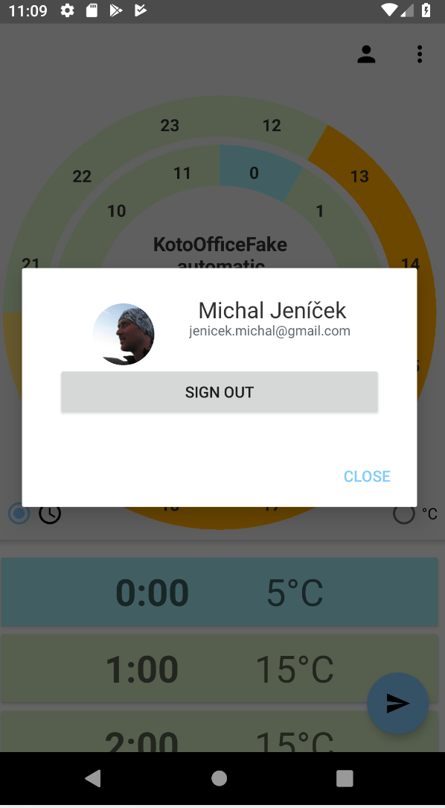

# kotiheating-android

 &nbsp; 
Android client for kotiheating-arduino  
  

  
&nbsp;
 &nbsp;
&nbsp;  

#Privacy policy howto
https://play.google.com/about/privacy-security-deception/user-data/#!?zippy_activeEl=personal-sensitive#personal-sensitive

#Privacy policy for app
https://jenicek.dev/kotiheat/kotiheat-privacy-policy/